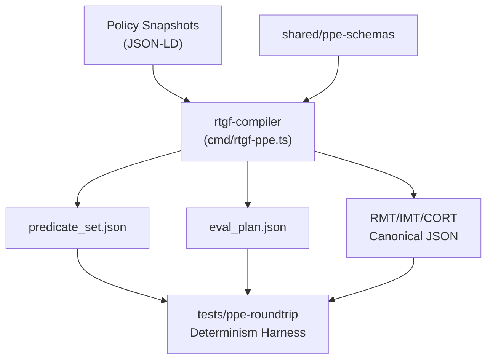
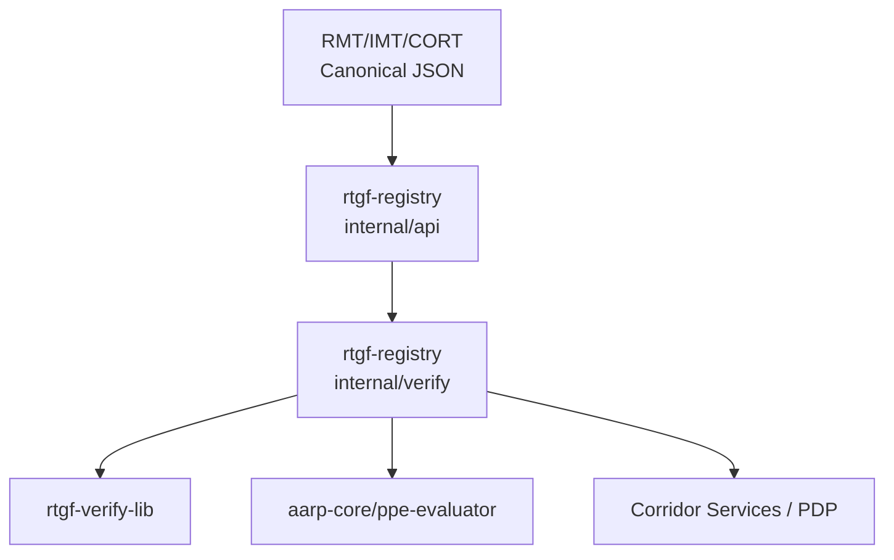
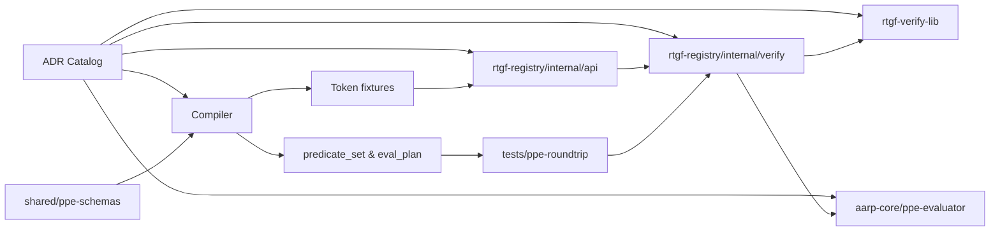

# RTGF Software Architecture

This document presents the module-level architecture of the Reference Token Generation Framework (RTGF). It explains codebase boundaries, primary workflows, data contracts, and extension points. For system deployment topology see `SYSTEMS_ARCHITECTURE.md`; for design rationale refer to `docs/architecture/rtgf/adr/`.

---

## 1. Module Overview

| Module | Language | Description |
|--------|----------|-------------|
| `rtgf-compiler/` | TypeScript | Deterministic compiler for predicates, evaluation plans, and token assembly (ADR-RTGF-003, 004, 008). |
| `rtgf-registry/` | Go | HTTP service serving tokens, catalog, JWKS, transparency proofs, and revocation APIs (ADR-RTGF-005, 006, 007). |
| `rtgf-verify-lib/` | Go | Library for loading tokens, validating metadata, and performing lightweight checks (embedded in verifier service). |
| `aarp-core/ppe-evaluator/` | TypeScript | Runtime evaluation engine for predicate plans (used by verifier and corridor enforcement). |
| `tests/ppe-roundtrip/` | TypeScript | Deterministic integration harness ensuring compile/evaluate flows are reproducible (Phase 2). |
| `shared/ppe-schemas/` | JSON Schema | Canonical definitions for predicates, evaluation plans, operator metadata. |
| `docs/architecture/rtgf/adr/` | Markdown | Architecture decision records aligning modules and contracts. |

Supporting assets: `examples/`, `schemas/`, `docs/openapi/registry-openapi.yaml`, `docs/testing/*`.

---

## 2. Core Workflows

### 2.1 Build-Time Flow

- `cmd/rtgf-ppe.ts` exposes CLI (`compile --snapshot --out --plan-out`).  
- `roundtrip.test.ts` ensures byte-identical output; AJV validation against schemas.  
- Build manifest includes evidence hashes, predicate IDs, evaluation sequence.

### 2.2 Run-Time Flow

- Registry handlers implemented in `internal/api`.  
- Verification logic in `internal/verify`, leveraging `rtgf-verify-lib` for metadata checks and `ppe-evaluator` for predicate evaluation.  
- Revocation logic increments `revEpoch` and exposes status (ADR-RTGF-005, 009).

---

## 3. Module Details

### 3.1 `rtgf-compiler` (TypeScript)
- **Entry point:** `cmd/rtgf-ppe.ts` (`run()` / `compile()` functions).  
- **Internal structure:**  
  - `internal/` (future): templates, mappers, hash utilities.  
  - `tests/` (Vitest) for deterministic round-trip.  
- **Key responsibilities:** parse policy snapshots, generate predicate order, build evaluation plan, produce canonical JSON.  
- **Dependencies:** AJV for schema validation, Node 18 runtime.  
- **Extension points:** plug-in predicate templates, additional artefact emitters (e.g., PSRT).  
- **Error handling:** throws usage errors, schema validation errors; integration harness ensures deterministic failure messages.

### 3.2 `rtgf-registry` (Go)
- **Packages:**  
  - `cmd/registryd`: bootstrap server, wiring dependencies.  
  - `internal/api`: HTTP handlers for `/tokens`, `/catalog`, `/jwks.json`, etc.  
  - `internal/verify`: `/verify`, `/revocations` endpoints and supporting service.  
  - `internal/transparency`, `internal/crypto`, `internal/storage` (stubs to be filled).  
- **Testing:** `internal/api/api_test.go`, `internal/verify/handler_test.go`, integration tests in `internal/integration/`.  
- **Data flow:** loads token fixtures (FS abstraction), matches URIs, returns JSON.  
- **Configuration:** command-line flags (`--addr`, `--static-dir`), environment (`RTGF_URL`).  
- **Extension points:** storage adapters, dynamic token fetchers, new handler groups (e.g., `/imt`).  
- **Error taxonomy:** HTTP Problem Details with codes per ADR-RTGF-005.

### 3.3 `rtgf-verify-lib` (Go)
- **Purpose:** lightweight token loader/metadata checker for use inside verifier/registry.  
- **Core types:** `StaticVerifier`, `TokenInfo` (JSON metadata).  
- **Functions:** `VerifyRRMT/CORT/PSRT`, `Token()`, `Metadata()`.  
- **Testing:** table-driven tests covering happy path, unknown tokens, invalid JSON, detectType mapping.  
- **Next steps:** extend to signature validation, revocation integration, error taxonomy alignment.

### 3.4 `aarp-core/ppe-evaluator` (TypeScript)
- **Function:** `evaluate(opts)` returns decision, controls, trace, digest.  
- **Current state:** placeholder evaluation logic; tests ported from spec to Vitest (`tests/evaluator.test.ts`).  
- **Plan:** implement predicate execution (resolvers, operators, hashed traces) per ADR-RTGF-008.  
- **Integration:** invoked by verification API and CLI integration harness (Phase 2).

---

## 4. Data Contracts

| Contract | Location | Notes |
|----------|----------|-------|
| Predicate schema | `shared/ppe-schemas/predicate.schema.json` | AJV validates compile output; referenced in ADR-RTGF-008. |
| Eval plan schema | `shared/ppe-schemas/eval-plan.schema.json` | Sequence of stages, operations; hashed for determinism. |
| Token envelope | (to be formalised) `docs/openapi/registry-openapi.yaml` | Ensure canonical serialization matches specification. |
| Verification API | `docs/openapi/registry-openapi.yaml` `/verify` | Keep implementation (Go) aligned with OpenAPI definitions. |
| Transparency proofs | (future) JSON structures defined in ADR-RTGF-007 | Will be served via registry once implemented. |

Canonicalisation uses JSON Canonicalization Scheme (RFC 8785) at build time; verifiers recompute digests to confirm integrity.

---

## 5. Error Handling & Logging

- **Compiler:** throws typed errors (usage, validation). Integration harness interprets and surfaces exit codes.  
- **Registry API:** returns HTTP status codes + JSON Problem Details (`type`, `title`, `detail`, `code`). Logging includes request path, token slug, correlation ID.  
- **Verification service:** returns structured JSON with `Valid`, `Reason`, `RevEpoch`. Errors follow taxonomy defined in ADR-RTGF-005.  
- **Telemetry:** metrics exposed via Prometheus (Go) and instrumented Node telemetry (future). Audit trails aggregated via transparency log.

---

## 6. Dependency Graph

---

## 7. Extension Points & Roadmap

| Area | Planned Enhancement |
|------|---------------------|
| Compiler | Modular rule translators, multi-language bindings (Go CLI). |
| Registry | Persistent storage backend, OpenAPI-complete implementation, transparency integration. |
| Verification API | Streaming revocation updates, corridor-specific policy checks, rate limiting. |
| PPE Evaluator | Full predicate execution engine with resolver timeouts, hashing, explainability. |
| Testing | More integration suites, mutation testing, property-based checks per ADRs. |

---

## 8. Contribution & Coding Standards

- **TypeScript:** Node 18, strict mode, Vitest for testing, code style (ESLint/Prettier planned).  
- **Go:** Go 1.22+, table-driven tests, enforce gofmt/golangci-lint (to be wired).  
- **Docs:** ADR template standard, ensure PRs update relevant architecture docs.  
- **CI:** future GitHub Actions pipeline to run unit tests, integration harness, coverage gates, determinism checks.

---

## 9. References

- `docs/architecture/SYSTEMS_ARCHITECTURE.md` — infrastructure topology.  
- ADR-RTGF-001 … 010 — detailed decisions impacting software modules.  
- `docs/testing/TEST_STRATEGY.md` — testing philosophy.  
- `docs/openapi/registry-openapi.yaml` — verification & registry API contract.  
- `README.md` — repository layout and quick-start instructions.
