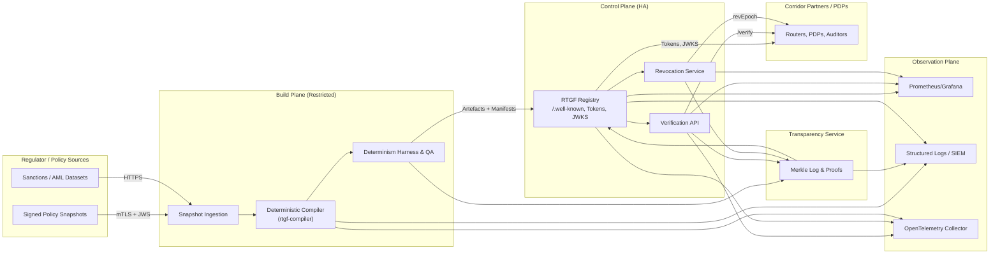

# RTGF Systems Architecture

This document describes the infrastructure-level architecture for the Reference Token Generation Framework (RTGF), covering deployment topology, trust boundaries, supporting services, and operational responsibilities. It complements the module-level view in `SOFTWARE_ARCHITECTURE.md` and the decision records in `docs/architecture/rtgf/adr/`.

---

## 1. High-Level Topology

### 1.1 Deployment Contexts
- **Build Plane (offline / restricted):** deterministic compiler cluster, dataset fetchers, transparency ingest. No inbound Internet traffic.
- **Control Plane:** registry, verifier API, revocation service, JWKS publisher, transparency API. Deployed across at least two regions/availability zones.
- **Observation Plane:** metrics stack (Prometheus, Grafana), logs (Loki/ELK), tracing (OTel collector), incident tooling (PagerDuty/Matrix).

---

## 2. Core Services & Responsibilities

| Service | Purpose | Deployment Notes |
|---------|---------|------------------|
| Snapshot Ingestion | Retrieve & validate policy snapshots, manage policy matrix | Runs in build plane; watches regulator endpoints or receives push events |
| RTGF Compiler | Deterministic artefact generation per ADR-RTGF-003 | Containerised workloads scheduled via CI/CD or orchestrator (Argo/Temporal) |
| Transparency Service | Append-only log of snapshots, tokens, JWKS, revocations | Requires durable storage (e.g., PostgreSQL + Merkle tree index) and signing keys |
| RTGF Registry | Public HTTPS service serving tokens, catalog, JWKS, transparency | Deploy behind CDN/edge proxies with TLS 1.3, mTLS for privileged routes |
| Verification API | Corridor-facing validation endpoint (ADR-RTGF-005) | Stateless service, horizontally scaled, cached token store |
| Revocation Service | Maintains `revEpoch`, exposes `/revocations` endpoints | Shares datastore with transparency log; supports push/pull updates |
| Dataset Fetcher | Periodic jobs capturing sanctions/AML datasets | Runs in build plane with whitelisted outbound egress |
| Observability Stack | Metrics, logs, traces, SLO enforcement (ADR-RTGF-010) | Shared platform with service-specific dashboards |

---

## 3. Environments & Trust Boundaries

| Plane | Trust Level | Key Controls |
|-------|-------------|--------------|
| Build Plane | High (internal only) | Network isolation, hermetic builds, HSM-backed signing, restricted operator access |
| Control Plane | Medium (partner-facing) | mTLS, OAuth for read-only, Web Application Firewall (WAF), DANE/TLSA, rate limiting |
| Observation Plane | Internal/shared | RBAC to dashboards, audit logging, PII scrubbing, signed incident reports |
| External Partners | Low (untrusted) | Tokens served via registry, verification API behind mTLS/OIDC, Problem Details for errors |

Key network segments:
- **Compiler VPC** → only outbound to regulators and dataset providers; inbound via VPN/jump host.
- **Registry/Verifier VPC** → dual AZ load balancers, edge firewall, CDN integration.
- **Transparency DB** → private subnets, accessible only from compiler & registry clusters.
- **KMS/HSM** → dedicated network segment, access via signed service accounts.

---

## 4. Data Stores & Persistence

| Store | Technology | Purpose | Retention |
|-------|------------|---------|-----------|
| Snapshot repository | Object storage (S3/GCS) | Raw & validated snapshots, manifests | ≥ 10 years |
| Compiler artefacts | Immutable storage + Git LFS | Predicate sets, eval plans, canonical JSON | ≥ 10 years |
| Transparency DB | SQL + Merkle tree (e.g., PostgreSQL + custom table) | Events, tree nodes, proofs | Infinite (append-only) |
| Registry cache | Redis / Memcached | Token JSON, JWKS, revocation state | Short-term (≤ 1 h) |
| Revocation store | SQL/NoSQL | `revEpoch` counters, revocation details | Rolling window + archive |
| Observability | Time-series DB / log store | Metrics, traces, logs | 30–90 days (metrics), 180 days (logs) |

Backups:
- Daily encrypted snapshots of transparency DB and revocation store.
- Weekly archival of compiler artefacts to cold storage.
- Disaster recovery: warm standby region with replicated DBs and automated failover.

---

## 5. Security Controls & Key Management

- **mTLS Everywhere:** registry/verifier/revocation services require client certs for write operations; read-only endpoints enforce TLS with HSTS.
- **Key Hierarchy:**  
  - Root signing keys stored offline.  
  - Online Ed25519 keys managed via HSM; rotated quarterly (ADR-RTGF-006).  
  - JWKS served with signed transparency entries; watchers monitor for mismatch.
- **Access Control:**  
  - Build jobs triggered via signed CI pipelines; approvals required for production publish.  
  - Least-privilege IAM roles for dataset fetchers, registry deployments, transparency updates.
- **Secrets Management:** Vault or cloud KMS for API credentials, dataset tokens, DB passwords.
- **Compliance Logging:** All key operations logged with actor, timestamp, change description; logs shipped to SIEM.

---

## 6. Availability & Scaling

- **Registry & Verifier:** auto-scaling stateless services, deploy across multiple regions with active-active load balancing. CDN terminates TLS; origin supports HTTP/2 + AARP ALPN.
- **Transparency Service:** runs as stateful cluster; vertical scaling for Merkle operations, horizontal read replicas for proof generation.
- **Revocation Service:** caches revocation data in-memory, replicates to follower nodes; failover handled via Raft/Zookeeper.
- **Compiler Pipeline:** scale-out across build workers; queue-based orchestration to handle multiple jurisdictions.
- **Disaster Recovery:** runbook defines RTO ≤ 1 h for registry/verifier, ≤ 4 h for transparency DB (via PITR). Quarterly failover drills.

---

## 7. Monitoring & Alerting

- **Golden Signals:** latency, traffic, errors, saturation per service.  
- **Custom Metrics:** revEpoch drift, token cache hit ratio, transparency proof latency, build determinism checks.  
- **Alert Routing:** severity matrix (P0: availability, P1: revocation staleness, P2: dataset fetch failures).  
- **Dashboards:**  
  - Systems health (per plane).  
  - Pipeline status (build durations, determinism).  
  - Registry/verifier response heatmaps.  
  - Transparency proof backlog.
- **Logs & Traces:** correlation IDs propagate from registry → verifier → transparency to trace request lifecycle.

---

## 8. Operational Runbooks & Dependencies

| Runbook | Trigger | Key Steps |
|---------|---------|-----------|
| Determinism failure | `RTGF_PIPELINE_DETERMINISM_FAIL` | Freeze publication, compare manifests, escalate to compiler team |
| Revocation lag | `revEpoch` drift > threshold | Inspect revocation service, sync transparency log, notify corridor leads |
| JWKS rotation | Scheduled quarterly | Generate new keys, update JWKS, notify partners, monitor for `kid_unknown` errors |
| Transparency outage | Proof generation fails | Switch to standby node, verify append-only integrity, publish incident |

External dependencies:
- Regulator snapshot endpoints (HTTPS).
- Dataset providers (sanctions, AML).
- CDN provider for registry caching.
- Identity provider for operator access (SSO).
- Incident management platform (PagerDuty/Matrix).

---

## 9. Future Enhancements

- Multi-cloud footprint for registry/verifier to meet jurisdictional redundancy requirements.
- Zero-knowledge proof integration for sensitive evidence (Mandala alignment).
- Automated compliance auditing (policy-to-token coverage reports).
- Expanded observability with anomaly detection for revocation patterns.

---

**References:**  
- ADR-RTGF-003, 004, 005, 006, 007, 008, 009, 010 — detailed design decisions.  
- `docs/architecture/rtgf-pipeline.md` — deterministic flow blueprint.  
- `docs/testing/TEST_STRATEGY.md` — testing expectations for systems integration.  
- `docs/testing/COVERAGE_UPLIFT_PLAN.md` — QA roadmap impacting deployment readiness.
