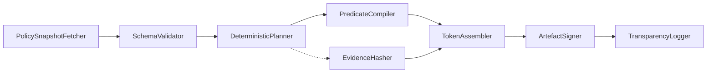

# ADR-RTGF-003: Compiler & Deterministic Build Pipeline

**Status:** Accepted  
**Date:** 2025-11-02  
**Decision Makers:** RTGF Working Group  
**Owner:** Compiler & Evidence Subsystem Team  
**Related ADRs:** ADR-RTGF-001 (Policy Source Matrix), ADR-RTGF-002 (Sanctions Hashing), ADR-RTGF-004 (Token Encodings)

**Planned Tests:** RTGF-CT-20, RTGF-CT-21, RTGF-CT-22, RTGF-CT-23

---

## 1. Purpose & Scope
Provide a reproducible, hermetic build pipeline that converts signed policy snapshots into canonical RTGF artefacts (predicate sets, evaluation plans, RMT/IMT/CORT tokens) with deterministic outputs, cryptographic provenance, and fail-closed security controls.

## 2. Decision
Adopt the following staged pipeline:

- **PolicySnapshotFetcher:** retrieve signed snapshots (ADR-RTGF-001), verify manifest checksums, enforce ontology version.  
- **SchemaValidator:** validate JSON-LD + signature; fail closed on mismatch.  
- **DeterministicPlanner:** order predicates/evidence, capture toolchain + ontology versions in `build_manifest.json`.  
- **PredicateCompiler:** generate predicate set & evaluation plan using shared schemas.  
- **EvidenceHasher:** compute SHA-256 (RFC 8785 canonical JSON) across external datasets (ADR-RTGF-002).  
- **TokenAssembler:** build canonical RMT/IMT/CORT tokens (ADR-RTGF-004) embedding manifest IDs, evidence hashes, revEpoch baseline.  
- **ArtefactSigner:** sign canonical JSON with Ed25519 keys via HSM, record signature metadata.  
- **TransparencyLogger:** append artefact hashes + manifest references to transparency service for independent audit.

## 3. Determinism & Provenance
- All inputs pinned to snapshot version, evidence hashes, and ontology manifest (`ontology/manifests/checksum-manifest.json`).  
- Canonical JSON (RFC 8785) for predicate sets, plans, and tokens; stable key ordering.  
- `build_manifest.json` records toolchain versions, deterministic seeds, evidence claims.  
- Hash conventions: `sha256` for predicate/plan outputs; `sha512` for canonical token envelopes.  
- Deterministic runtime environment: enforce `TZ=UTC`, `LANG=C`, `RTGF_SEED=1337`.  
- revEpoch baseline captured during build; later revocations increment transparently.

## 4. Security & Trust
- Pipeline runs in hermetic container with pinned dependencies.  
- Snapshot signatures verified against regulator JWKS; build aborts on failure.  
- Signing keys stored in HSM; access via mTLS; dual-control for release operations.  
- Transparency logger ensures each artefact has traceable provenance.  
- RBAC approvals for build/publish operations recorded in audit log.

## 5. Error Taxonomy
| Code | Condition | Action |
|------|----------|--------|
| `RTGF_BUILD_SNAPSHOT_INVALID` | Snapshot signature/schema invalid | Abort build, alert operator |
| `RTGF_BUILD_PLAN_DIVERGENCE` | Deterministic diff mismatch | Halt promotion, diff manifests |
| `RTGF_BUILD_SIGNING_ERROR` | HSM signing failure | Retry ×3 then fail closed |
| `RTGF_BUILD_HASH_MISMATCH` | Post-signature digest mismatch | Abort; investigate integrity |
| `RTGF_BUILD_TRANSPARENCY_FAIL` | Transparency append failure | Retry, then fail closed |

## 6. Metrics & SLOs
| Metric | Target | Notes |
|--------|--------|-------|
| `rtgf_build_duration_seconds_bucket` | ≤ 5 min P95 per jurisdiction/domain | assuming cached datasets |
| Determinism diff check | 100% pass | compile twice, compare hashes |
| Signing success rate | ≥ 99.99% | per artefact |
| Transparency append latency | ≤ 1 min P95 | measured end-to-end |

## 7. Interfaces & Integration
| Dependency | Direction | Purpose |
|------------|-----------|---------|
| Policy Source Matrix | inbound | Retrieve signed policy snapshots |
| Sanctions dataset fetcher | inbound | Provide data for evidence hashing |
| Transparency service | outbound | Log manifests, artefact digests |
| Revocation service | outbound | Capture baseline `revEpoch` |
| PPE evaluator harness | outbound | Execute deterministic round-trip tests |

## 8. Observability
- Prometheus: `rtgf_build_duration_seconds_bucket`, `rtgf_build_failures_total{code}`, `rtgf_artifact_sign_total`, `rtgf_transparency_append_total{result}`.  
- Structured logs: snapshot ID, manifest ID, tool versions, hash digests.  
- OpenTelemetry span `rtgf.compiler.run` with child spans per stage (validation, compile, signing, transparency).

## 9. Planned Tests
| Test ID | Scenario | Expected Outcome |
|---------|----------|------------------|
| RTGF-CT-20 | Compile snapshot twice | Hashes/manifests identical across runs |
| RTGF-CT-21 | Invalid snapshot signature | Build stops with `RTGF_BUILD_SNAPSHOT_INVALID` |
| RTGF-CT-22 | Evidence hash mismatch | Build aborts pre-signing; no transparency entry |
| RTGF-CT-23 | HSM signing failure simulation | Retry ×3 then emit `RTGF_BUILD_SIGNING_ERROR` |

## 10. Acceptance Criteria
1. Pipeline emits identical artefacts (predicate sets, eval plans, RMT/IMT/CORT tokens) for identical inputs; diff manifests identical.  
2. All outputs signed, logged, and linked to transparency entries; replay tooling can recompute hashes.  
3. Build halts on any validation/signing/transparency failure (fail-closed).  
4. Observability instrumentation deployed; CT-20..23 passing in CI.

## 11. Consequences
- ✅ Ensures regulators and auditors can reproduce RTGF artefacts independently.  
- ✅ Transparency manifests accelerate cross-system replay validation.  
- ⚠️ Hermetic builds & deterministic double-runs increase compute cost and require dependency pinning/HSM automation.  
- ⚠️ Operators must maintain ontology & toolchain manifests; stale manifests block builds.
