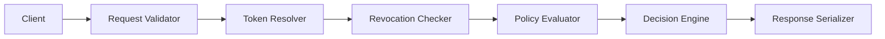

# ADR-RTGF-005: Verification API & Error Taxonomy

**Status:** Accepted  
**Date:** 2025-11-02  
**Decision Makers:** RTGF Working Group  
**Owner:** Verification Service Team  
**Related ADRs:** ADR-RTGF-001 (Policy Source Matrix), ADR-RTGF-002 (Sanctions Hashing), ADR-RTGF-004 (Token Encodings), ADR-RTGF-006 (Trust Model)

**Planned Tests:** RTGF-CT-40, RTGF-CT-41, RTGF-CT-42, RTGF-CT-43, RTGF-CT-44

---

## 1. Purpose & Scope
Define the RTGF verification service contract: REST endpoints, deterministic response semantics, error taxonomy, and observability. The service validates RMT/IMT/CORT/PSRT tokens against canonical hashes, signatures, revocation state, and (optionally) policy predicates so corridor partners and auditors can rely on a single verification authority.

## 2. Decision
Adopt a layered verification service with the following flow:

- **Request Validator:** enforce schema, required token URIs, authentication (mTLS/OAuth2).  
- **Token Resolver:** retrieve canonical token JSON from registry/cache; validate canonical hash.  
- **Revocation Checker:** compare `revEpoch` against revocation service; consult transparency proofs when supplied.  
- **Policy Evaluator:** (optional) run PPE evaluation using predicate set/eval plan for runtime decisions.  
- **Decision Engine:** collate evidence, produce deterministic `{Valid, Reason, RevEpoch, Controls}` response, audit log entry.  
- **Response Serializer:** emit canonical JSON (stable ordering, RFC 8792).  
- Rate limiting and circuit breaking wrap the entire pipeline to protect shared infrastructure.

## 3. Determinism & Provenance
- Identical inputs produce identical responses (field order, value casing, numeric precision).  
- Token payloads validated via canonical hash before use; mismatches flagged (`RTGF_TOKEN_CANONICAL_MISMATCH`).  
- `revEpoch` returned equals current revocation counter at decision time.  
- Audit log: request ID, client ID, token URIs, digests, decision, latency, revocation state.  
- Idempotent POST `/verify` requests (same body + `Idempotency-Key`) produce same response and telemetry.

## 4. Security & Trust
- TLS 1.3 required; corridor partners use mTLS. Read-only clients may use OAuth2 client credentials.  
- Token retrieval performed over mTLS; cached entries validated before reuse.  
- Rate limiting per client; fail closed on registry or revocation timeouts.  
- Inputs sanitised; responses omit sensitive internals.  
- JWKS rotation monitored; unknown `kid` triggers fetch and failure if unresolved.

## 5. Error Taxonomy
| Code | HTTP | Condition | Action |
|------|------|----------|--------|
| `RTGF_VERIFY_MISSING_TOKEN` | 400 | Required token URI absent/blank | Return Problem Details; client resubmits |
| `RTGF_VERIFY_TOKEN_NOT_FOUND` | 404 | Registry missing token | Problem Details with advice to refresh cache |
| `RTGF_VERIFY_SIGNATURE_INVALID` | 422 | Token signature invalid | Reject; advise JWKS refresh |
| `RTGF_VERIFY_REVOKED` | 200 | Token revoked / stale `revEpoch` | Return `Valid=false`, include reason |
| `RTGF_VERIFY_RATE_LIMIT` | 429 | Rate limit triggered | Return `Retry-After`, recommend backoff |
| `RTGF_VERIFY_INTERNAL` | 500 | Unexpected error | Fail closed; alert SRE |

Problem Details responses include `type`, `title`, `status`, `detail`, `code`, `instance`.

## 6. Metrics & SLOs
| Metric | Target | Notes |
|--------|--------|-------|
| `rtgf_verify_latency_ms_bucket` | ≤ 100 ms P95 | assuming cached tokens |
| `rtgf_verify_requests_total{result}` | 100% tagged responses | success vs failure |
| Availability | ≥ 99.95% monthly | tracked via SLO tooling |
| Error budget | ≤ 0.1% 5xx | rolling 30 days |
| Rate-limit accuracy | ≤ 1% false positives | per client |

## 7. Interfaces & Integration
| Dependency | Direction | Purpose |
|------------|-----------|---------|
| RTGF Registry | inbound | Token + JWKS retrieval |
| Revocation service | inbound | Current `revEpoch`, revocation proofs |
| PPE Evaluator | outbound | Execute predicate decisions (when enabled) |
| Transparency log | inbound | Validate hash linkage / revocation lineage |
| Observability stack | outbound | Emit metrics, traces, logs |

## 8. Observability
- Prometheus: `rtgf_verify_latency_ms_bucket`, `rtgf_verify_requests_total{result,code}`, `rtgf_verify_cache_hits_total`, `rtgf_verify_rate_limit_total{client}`.  
- Logs: structured JSON including request ID, client ID, token URIs, decision, reason code, latency.  
- OpenTelemetry: parent span `rtgf.verify.request` with child spans for resolver, revocation, PPE evaluation.

## 9. Planned Tests
| Test ID | Scenario | Expected Outcome |
|---------|----------|------------------|
| RTGF-CT-40 | Valid token set | 200, `Valid=true`, revEpoch current |
| RTGF-CT-41 | Missing RMT URI | 400 Problem Details `RTGF_VERIFY_MISSING_TOKEN` |
| RTGF-CT-42 | Revoked token | 200, `Valid=false`, reason includes `RTGF_VERIFY_REVOKED` |
| RTGF-CT-43 | Signature invalid | 422 Problem Details `RTGF_VERIFY_SIGNATURE_INVALID` |
| RTGF-CT-44 | Rate limit scenario | 429 with `Retry-After`; metrics increment |

## 10. Acceptance Criteria
1. `/verify` responses deterministic, conform to schema, and CT-40..44 pass.  
2. Error taxonomy enforced in API responses, logs, and metrics; 5xx budget maintained.  
3. Revocation checks, canonical hash validation, and signature verification fail closed.  
4. Observability (metrics, traces, logs) deployed and integrated with alerting.

## 11. Consequences
- ✅ Consistent verification semantics for corridor partners and auditors.  
- ✅ Clear error taxonomy accelerates troubleshooting and governance reporting.  
- ⚠️ Strong security (mTLS, rate limiting) raises integration complexity.  
- ⚠️ Deterministic responses require careful cache/version management; stale data triggers false negatives.
