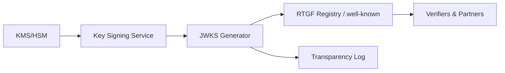

# ADR-RTGF-006: JWKS, DANE/TLSA & Trust Model

**Status:** Accepted  
**Date:** 2025-11-02  
**Decision Makers:** RTGF Working Group  
**Owner:** Trust & Security Subsystem Team  
**Related ADRs:** ADR-RTGF-003 (Compiler Pipeline), ADR-RTGF-004 (Token Encodings), ADR-RTGF-005 (Verification API)

**Planned Tests:** RTGF-CT-50, RTGF-CT-51, RTGF-CT-52, RTGF-CT-53, RTGF-CT-54

---

## 1. Purpose & Scope
Establish the trust fabric for RTGF artefacts: key generation, JWKS publication, DANE/TLSA anchoring, and mutual TLS between components. This ensures every consumer can authenticate issuers/regulators and verify signatures deterministically.

## 2. Decision
Adopt a layered key-management architecture:

- **Key Signing Service:** Interfaces with HSM to create Ed25519 key pairs, enforce dual control for rotation.  
- **JWKS Generator:** Produces canonical JWKS (`/.well-known/jwks.json`) containing `kid`, `alg`, `use`, `createdAt`, `expiresAt`.  
- **Registry Publication:** Serve JWKS via TLS 1.3, optionally sign JWKS payload (JWS).  
- **Transparency Log:** Record JWKS digests and rotation events for audit.  
- **DANE/TLSA Anchors:** Publish `_443._tcp.<domain>` TLSA records binding registry certificates; clients validate when configured.  
- **Client Consumption:** Verifiers fetch JWKS, obey cache headers, and refresh on unknown `kid`.

## 3. Determinism & Provenance
- JWKS canonicalized (sorted keys) and hashed (`sha256`) before publication; digest stored in transparency log.  
- `kid` format: `<issuer>:<alg>:<yyyy-mm>:<sequence>` ensures deterministic mapping.  
- Rotation overlap window: 7 days where old and new keys co-exist.  
- `key_manifest.json` records key lineage (`issued_at`, `expires_at`, `revoked_at`, transparency digest).  
- Emergency key revocation: publish JWKS with `revoked=true` and notify partners.

## 4. Security & Trust
- HSM-backed keys: no raw private key exposure; audit all operations.  
- TLS 1.3 + HSTS; registry/verifier/compiler communications use mTLS.  
- DANE/TLSA recommended; clients fail-closed on mismatch when policy requires.  
- JWKS payload optionally JWS-signed with offline root for additional assurance.  
- JWKS cache invalidation: respect `Cache-Control: max-age`; refresh immediately on unknown `kid` or verification failure.

## 5. Error Taxonomy
| Code | Condition | Action |
|------|----------|--------|
| `RTGF_JWKS_FETCH_FAILED` | Unable to retrieve JWKS | Retry with backoff; fail closed |
| `RTGF_JWKS_SIGNATURE_INVALID` | JWKS digest/signature mismatch | Reject, alert SRE |
| `RTGF_KID_EXPIRED` | Key past `expiresAt` | Reject token, prompt refresh |
| `RTGF_KID_UNKNOWN` | Token references unknown `kid` | Refresh JWKS; fail if unresolved |
| `RTGF_TLSA_MISMATCH` | TLSA/DANE validation failure | Fail connection, log violation |

## 6. Metrics & SLOs
| Metric | Target | Notes |
|--------|--------|-------|
| JWKS fetch latency | ≤ 200 ms P95 | CDN + caching |
| JWKS availability | ≥ 99.99% | measured monthly |
| Rotation window | ≤ 7 days | overlapping validity |
| Compromise detection | ≤ 15 min MTTR | via monitoring |

## 7. Interfaces & Integration
| Dependency | Direction | Purpose |
|------------|-----------|---------|
| HSM/KMS | inbound | Generate & store keys |
| Registry | outbound | Publish JWKS & DANE metadata |
| Transparency | outbound | Record JWKS digests/events |
| Verifiers/Partners | outbound | Provide trust anchors |
| DNS/DANE | outbound | Publish TLSA bindings |

## 8. Observability
- Prometheus: `rtgf_jwks_fetch_total{result}`, `rtgf_key_rotation_events_total`, `rtgf_kid_unknown_total`, `rtgf_tlsa_mismatch_total`.  
- Audit logs: key issuance, rotation, revocation with actor/reason/timestamps.  
- Alerts: JWKS fetch failures, TLSA mismatches, expired keys in use.

## 9. Planned Tests
| Test ID | Scenario | Expected Outcome |
|---------|----------|------------------|
| RTGF-CT-50 | Fetch JWKS | Matches canonical digest; schema valid |
| RTGF-CT-51 | Rotate key (overlap) | Old/new signatures accepted during grace window |
| RTGF-CT-52 | Use expired `kid` | Verification fails with `RTGF_KID_EXPIRED` |
| RTGF-CT-53 | DANE/TLSA mismatch | Client detects and fails connection |
| RTGF-CT-54 | JWKS tampered | Consumer rejects due to digest mismatch |

## 10. Acceptance Criteria
1. JWKS publication automated with transparency logging; CT-50..54 pass.  
2. Key rotation policy documented with overlapping validity to avoid verification gaps.  
3. mTLS and DANE/TLSA validation implemented; failures handled fail-closed.  
4. Observability metrics/logs/alerts deployed for key lifecycle and JWKS integrity.

## 11. Consequences
- ✅ Strong trust foundation for token verification and corridor interoperability.  
- ✅ Formal lifecycle management shortens compromise response time.  
- ⚠️ HSM integration and DANE setup introduce operational overhead.  
- ⚠️ Strict expiration demands partner coordination; stale clients risk outages.
