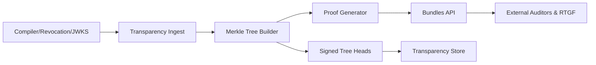

# ADR-RTGF-007: Transparency & Proof Bundles for RTGF

**Status:** Accepted  
**Date:** 2025-11-02  
**Decision Makers:** RTGF Working Group  
**Owner:** Transparency & Audit Subsystem Team  
**Related ADRs:** ADR-RTGF-003 (Compiler Pipeline), ADR-RTGF-004 (Token Encodings), ADR-RTGF-006 (Trust Model)

**Planned Tests:** RTGF-CT-60, RTGF-CT-61, RTGF-CT-62, RTGF-CT-63, RTGF-CT-64

---

## 1. Purpose & Scope
Define the transparency log and proof bundle architecture that records policy snapshots, compiler artefacts, tokens, JWKS rotations, and revocation events in an append-only Merkle structure. Provide auditors/verifiers with deterministic proof bundles that require no trusted intermediary.

## 2. Decision
Adopt a transparency service with the following flow:



- **Ingest:** accept signed events (`policy_snapshot`, `token_issue`, `revocation`, `jwks_publish`).  
- **Merkle Builder:** batch events, update Merkle root, sign tree heads (Ed25519 transparency key).  
- **Proof Generator:** issue inclusion/consistency proofs (RFC 6962 style).  
- **Bundles API:** expose `/proofs/{event_id}`, `/roots/latest`, and batch export endpoints.  
- **Transparency Store:** persist tree state, manifests, and signatures for replay.

## 3. Determinism & Provenance
- Events serialized via RFC 8785 canonical JSON; leaf hash `sha256(canonical_event)`.  
- Event IDs follow `evt:<type>:<UTC timestamp>:<uuid>` (clock synchronised via NTP).  
- Signed tree heads include `tree_size`, `root_hash`, `signature`, `issued_at`.  
- Proof bundle JSON deterministic: stable key order, arrays sorted.  
- Transparency log stores manifest linking event → token artefact → evidence hashes.

Example proof bundle:
```json
{
  "eventId": "evt:token_issue:2025-11-02T10:00:00Z:1234",
  "merkleRoot": "sha256:…",
  "leafHash": "sha256:…",
  "path": ["sha256:…", "sha256:…"],
  "consistency": ["sha256:…"],
  "issuedAt": "2025-11-02T10:00:05Z",
  "signatures": [
    {"alg": "EdDSA", "kid": "transparency:2025-10:001", "value": "…"}
  ]
}
```

## 4. Security & Trust
- Transparency ingest requires mTLS and signed payloads; invalid signatures rejected.  
- Tree head signatures use dedicated transparency key pair anchored by ADR-RTGF-006.  
- Bundles API read-mostly; auditor access uses API keys/mTLS.  
- Append-only property monitored; inconsistency triggers incident response.  
- Optional cross-log gossip with external logs to detect equivocation.

## 5. Error Taxonomy
| Code | Condition | Action |
|------|----------|--------|
| `RTGF_TXP_EVENT_INVALID` | Event payload fails schema/signature | Reject, log error |
| `RTGF_TXP_APPEND_VIOLATION` | Append breaks Merkle invariants | Halt ingest, alert SRE |
| `RTGF_TXP_PROOF_NOT_FOUND` | Proof requested for missing event | Return 404 |
| `RTGF_TXP_ROOT_SIGNATURE_INVALID` | Tree head signature invalid | Mark root invalid, raise incident |
| `RTGF_TXP_GOSSIP_INCONSISTENT` | Cross-log comparison fails | Alert, initiate investigation |

## 6. Metrics & SLOs
| Metric | Target | Notes |
|--------|--------|-------|
| Proof generation latency | ≤ 500 ms P95 | inclusion proofs |
| Root publication interval | ≤ 5 min | tree head exposure |
| Append validation coverage | 100% | each append verified |
| Bundles API availability | ≥ 99.9% | measured monthly |

## 7. Interfaces & Integration
| Dependency | Direction | Purpose |
|------------|-----------|---------|
| Compiler | inbound | Log token issuance events |
| Revocation service | inbound | Log revocation updates |
| JWKS generator | inbound | Anchor JWKS rotations |
| Auditors/Verifiers | outbound | Provide proofs & roots |
| External logs | outbound | Cross-gossip consistency checks |

## 8. Observability
- Prometheus: `rtgf_transparency_ingest_total{result,type}`, `rtgf_transparency_proof_latency_ms_bucket`, `rtgf_transparency_root_publish_total{result}`, `rtgf_transparency_append_failures_total`.  
- Audit logs: event ID, leaf hash, tree size, signature KID, caller identity.  
- Alerts: append violations, proof generation failures, root signature mismatches, gossip inconsistencies.

## 9. Planned Tests
| Test ID | Scenario | Expected Outcome |
|---------|----------|------------------|
| RTGF-CT-60 | Issue token & retrieve proof | Proof verifies against root |
| RTGF-CT-61 | Tampered payload | Reject with `RTGF_TXP_EVENT_INVALID` |
| RTGF-CT-62 | Unknown event proof | 404 `RTGF_TXP_PROOF_NOT_FOUND` |
| RTGF-CT-63 | Consistency proof check | Valid across sequential roots |
| RTGF-CT-64 | Append violation | Service halts, incident raised |

## 10. Acceptance Criteria
1. All issuance/revocation/JWKS events recorded with deterministic hashes and retrievable proofs; CT-60..64 pass.  
2. Transparency log enforces append-only property with signed tree heads and consistency proofs.  
3. Proof bundle format documented; verifiers can validate without trusted access.  
4. Observability detects anomalies in root publication, proof generation, or append operations.

## 11. Consequences
- ✅ External auditors can verify RTGF artefacts independently.  
- ✅ Cross-log gossip detects equivocation attempts.  
- ⚠️ Transparency infrastructure requires reliable storage and signature management.  
- ⚠️ Consumers must implement proof verification to benefit from transparency guarantees.
