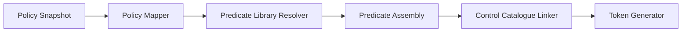

# ADR-RTGF-008: Policy Rule Algebra & Token Generation Semantics

**Status:** Accepted  
**Date:** 2025-11-02  
**Decision Makers:** RTGF Working Group  
**Owner:** Policy Mapping & Compiler Team  
**Related ADRs:** ADR-RTGF-001 (Policy Source Matrix), ADR-RTGF-002 (Sanctions Hashing), ADR-RTGF-003 (Compiler Pipeline), ADR-RTGF-004 (Token Encodings)

**Planned Tests:** RTGF-CT-70, RTGF-CT-71, RTGF-CT-72, RTGF-CT-73, RTGF-CT-74

---

## 1. Purpose & Scope
Define the deterministic rule algebra that maps policy snapshot clauses into executable predicates, controls, and evidence references embedded within RTGF tokens.

## 2. Decision
Adopt a deterministic mapping pipeline:

- **Policy Mapper:** interpret obligations/prohibitions/controls, normalize clause IDs.  
- **Predicate Library Resolver:** map clause types to canonical predicate templates (`shared/ppe-schemas`).  
- **Predicate Assembly:** populate templates with jurisdiction-specific parameters, citations.  
- **Control Catalogue Linker:** align controls with canonical catalogue; enforce approvals.  
- **Token Generator:** integrate predicates/controls into tokens (ADR-RTGF-003/004).

## 3. Determinism & Provenance
- Clause grouping order: obligations → prohibitions → controls; within groups sort by clause ID (lexicographic).  
- Predicate IDs derived from clause hash: `pred.<jurisdiction>.<domain>.<sequence>`.  
- `policy_token_map.json` stores mapping `{clause_id, predicate_id, control_id, provenance_citation}`.  
- Provenance metadata includes legal references (article, paragraph) and evidence pointers.  
- Manual review queue (`manual_review.json`) captures unsupported clauses with rationale.

## 4. Security & Trust
- Mapping rules version-controlled; changes require reviewer approval.  
- Predicate library signed (checksum manifest); mapping verifies signature before use.  
- Unknown controls rejected (`RTGF_MAP_CONTROL_UNKNOWN`); manual approval needed.  
- Mapping engine executes within compiler’s hermetic environment.

## 5. Error Taxonomy
| Code | Condition | Action |
|------|----------|--------|
| `RTGF_MAP_UNSUPPORTED_CLAUSE` | Clause type unsupported | Route to manual review queue |
| `RTGF_MAP_PREDICATE_TEMPLATE_MISSING` | Template missing | Fail build; add to backlog |
| `RTGF_MAP_CONTROL_UNKNOWN` | Control absent from catalogue | Fail build; update catalogue |
| `RTGF_MAP_RULE_CONFLICT` | Precedence conflict | Alert policy team, halt build |

## 6. Metrics & SLOs
| Metric | Target | Notes |
|--------|--------|-------|
| Mapping duration | ≤ 2 min per snapshot | includes deterministic diff check |
| Manual review rate | ≤ 5% clauses | indicator of template coverage |
| Control alignment | 100% | enforced by catalogue |

## 7. Interfaces & Integration
| Dependency | Direction | Purpose |
|------------|-----------|---------|
| Policy Source Matrix | inbound | Provide clause data |
| Predicate template library | inbound | Canonical predicate definitions |
| Control catalogue | inbound | Approved control identifiers |
| Compiler pipeline | outbound | Predicate set & eval plan JSON |
| QA tooling | outbound | Manual review dashboards |

## 8. Observability
- Prometheus: `rtgf_policy_clause_mapped_total{status}`, `rtgf_policy_manual_review_total`, `rtgf_policy_mapping_duration_seconds`.  
- Logs: clause ID, predicate ID, mapping path, provenance citation.  
- Dashboard: coverage per jurisdiction/domain, manual review backlog.

## 9. Planned Tests
| Test ID | Scenario | Expected Outcome |
|---------|----------|------------------|
| RTGF-CT-70 | Standard obligation clause | Maps to deterministic predicate ID |
| RTGF-CT-71 | Unsupported clause | Build halts with `RTGF_MAP_UNSUPPORTED_CLAUSE` |
| RTGF-CT-72 | Control alignment | Unknown control triggers `RTGF_MAP_CONTROL_UNKNOWN` |
| RTGF-CT-73 | Clause order invariance | Mapping output identical regardless of input order |
| RTGF-CT-74 | Provenance capture | Predicate metadata contains legal citation |

## 10. Acceptance Criteria
1. Supported clauses mapped deterministically to predicate templates; CT-70..74 pass.  
2. Provenance recorded and auditable; manual review outputs stored.  
3. Predicate/control IDs stable across builds; manifests persisted with artefacts.  
4. Observability metrics/logs highlight mapping coverage and manual review load.

## 11. Consequences
- ✅ Consistent mapping ensures tokens accurately reflect policy obligations.  
- ✅ Provenance data simplifies audits and regulator feedback loops.  
- ⚠️ Template coverage requires ongoing policy engineering effort.  
- ⚠️ Manual review backlog can slow jurisdiction onboarding without automation.
