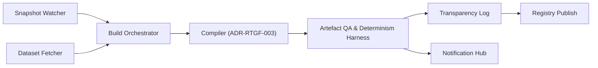

# ADR-RTGF-009: RTGF Compilation Pipeline & Reproducibility

**Status:** Accepted  
**Date:** 2025-11-02  
**Decision Makers:** RTGF Working Group  
**Owner:** Pipeline & Release Engineering Team  
**Related ADRs:** ADR-RTGF-001, ADR-RTGF-002, ADR-RTGF-003, ADR-RTGF-004, ADR-RTGF-007

**Planned Tests:** RTGF-CT-80, RTGF-CT-81, RTGF-CT-82, RTGF-CT-83, RTGF-CT-84

---

## 1. Purpose & Scope
Document the end-to-end orchestration for RTGF builds: snapshot ingestion, deterministic compilation, QA/determinism checks, transparency logging, and registry publication.

## 2. Decision
Adopt the following pipeline:

- **Snapshot Watcher:** detect new/updated snapshots, validate signatures/hashes.  
- **Build Orchestrator:** run hermetic builds, capture logs, enforce approvals.  
- **Dataset Fetcher:** retrieve evidence datasets (ADR-RTGF-002).  
- **Artefact QA:** run deterministic harness (`tests/ppe-roundtrip`), schema checks.  
- **Transparency Log:** append issuance/revocation/JWKS events (ADR-RTGF-007).  
- **Registry Publish:** deploy artefacts, JWKS updates, revocation baseline.  
- **Notification Hub:** send signed notifications to ops/partners.

## 3. Determinism & Provenance
- Build manifest records tool versions (`node`, `go`, compiler), git commits, ontology version.  
- Pipeline runs twice (double-run); compare manifests/hashes before promotion.  
- Environment pinned (`TZ=UTC`, `LANG=C`, `RTGF_SEED=1337`).  
- Provenance bundle stored with artefacts (snapshots, dataset hashes, logs).  
- Transparency log entry links build manifest to published tokens.

## 4. Security & Trust
- Pipeline triggers require signed approvals (RBAC).  
- Hermetic containers; outbound network restricted to allowlisted dataset endpoints.  
- Secrets stored in Vault with automatic rotation.  
- Publishing uses mTLS + signed manifests; fail closed if transparency logging fails.  
- Notifications signed, audit logged.

## 5. Error Taxonomy
| Code | Condition | Action |
|------|----------|--------|
| `RTGF_PIPELINE_DETERMINISM_FAIL` | Double-run diff mismatch | Halt promotion, alert SRE |
| `RTGF_PIPELINE_SNAPSHOT_FAIL` | Snapshot validation failure | Abort build |
| `RTGF_PIPELINE_QA_FAIL` | Schema/verification failures | Block publish |
| `RTGF_PIPELINE_PUBLISH_FAIL` | Registry publish failure | Retry ×3, alert |
| `RTGF_PIPELINE_TRANSPARENCY_FAIL` | Transparency logging failure | Retry, fail closed |

## 6. Metrics & SLOs
| Metric | Target | Notes |
|--------|--------|-------|
| Pipeline duration | ≤ 15 min per jurisdiction/domain | P95 |
| Determinism checks | 100% | double-run diff |
| Failed build resolution | ≤ 24 h P90 | detection to fix |
| Publish success | ≥ 99.9% | month rolling |

## 7. Interfaces & Integration
| Dependency | Direction | Purpose |
|------------|-----------|---------|
| Snapshot repository | inbound | Source snapshots |
| Dataset fetcher | inbound | Evidence material |
| Transparency log | outbound | Append build events |
| Registry | outbound | Deploy artefacts |
| Notification hub | outbound | Notify operators/partners |
| CI/CD system | inbound/outbound | Orchestrate builds |

## 8. Observability
- Prometheus: `rtgf_pipeline_runs_total{result}`, `rtgf_pipeline_duration_seconds`, `rtgf_pipeline_determinism_failures_total`, `rtgf_pipeline_publish_failures_total`.  
- Logs stored in immutable object storage; referenced in transparency records.  
- Dashboard: pipeline runs by jurisdiction, commit hash, dataset version, determinism diff results.

## 9. Planned Tests
| Test ID | Scenario | Expected Outcome |
|---------|----------|------------------|
| RTGF-CT-80 | Full build success | Digests match, artefacts published |
| RTGF-CT-81 | Determinism mismatch | Pipeline halts, no publish |
| RTGF-CT-82 | Snapshot validation failure | Pipeline stops with `RTGF_PIPELINE_SNAPSHOT_FAIL` |
| RTGF-CT-83 | Registry publish failure | Retries then alerts ops |
| RTGF-CT-84 | Transparency logging unreachable | Pipeline fails closed |

## 10. Acceptance Criteria
1. Pipeline guarantees deterministic builds (double-run) with CT-80..84 passing.  
2. Transparency logging and registry publish steps mandatory; failure halts release.  
3. Observability metrics/alerts detect determinism/publish/transparency issues.  
4. Provenance bundles stored for audit and replay.

## 11. Consequences
- ✅ Auditable, deterministic release process trusted by regulators.  
- ✅ Automation reduces manual errors and enforces consistent artefact quality.  
- ⚠️ Strict controls may delay urgent fixes; requires runbooks and incident response.  
- ⚠️ Double-run builds increase resource usage; plan capacity accordingly.
